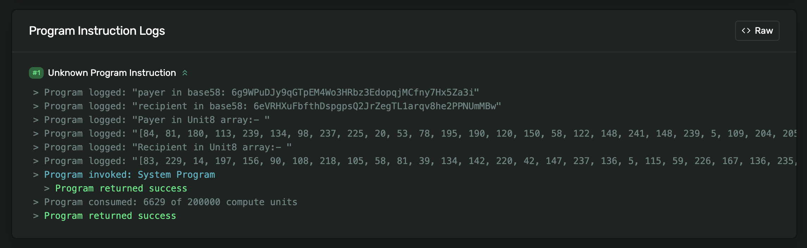

# Agave Custom Syscall Example

## Overview

This project is a **proof-of-concept (PoC)** demonstrating how to implement a custom syscall in the Solana blockchain runtime. In this project I've implemented a simple syscall to print a **Unit8 array of the pubkey**.

It is intended for advanced Solana developers and contributors who want to understand or extend Solana’s system call (syscall) interface with custom logic.

Custom syscalls allow you to add new low-level functionality to the Solana runtime, which can then be invoked by on-chain programs. This PoC walks through the process of defining, registering, and using a custom syscall, providing a practical reference for similar extensions.

---

## Project Structure

- **agave/**: Contains the core Solana runtime and related modules, with modifications to support the custom syscall.
- **native-test-syscall/**: Example Solana program and test suite that demonstrates how to invoke the custom syscall from on-chain code.
- **solana-sdk/**: SDK and client-side utilities, potentially with extensions to support the new syscall.
- **README.md**: This file.

---

## Implementation

1.  Define your syscall logic in `agave/programs/bpf_loader/src/syscalls`. I have added mine in logging.rs since my syscall is related to logging a pubkey.

    ```rust
    // Custom Syscall
    declare_builtin_function!(
        /// Log a [`Pubkey`] as a Unit8 array
        SyscallLogPubkeyAsUnit8,
        fn rust(
            invoke_context: &mut InvokeContext,
            pubkey_addr: u64,
            _arg2: u64,
            _arg3: u64,
            _arg4: u64,
            _arg5: u64,
            memory_mapping: &mut MemoryMapping,
        ) -> Result<u64, Error> {
            let cost = invoke_context.get_execution_cost().log_pubkey_units;
            consume_compute_meter(invoke_context, cost)?;

            let pubkey = translate_type::<Pubkey>(
                memory_mapping,
                pubkey_addr,
                invoke_context.get_check_aligned(),
            )?;
            let bytes = pubkey.to_bytes();
            let byte_str = bytes.iter().map(|b| b.to_string()).collect::<Vec<_>>().join(", ");
            let log_msg = format!("[{}]", byte_str);
            stable_log::program_log(&invoke_context.get_log_collector(), &log_msg);
            Ok(0)
        }
    );
    ```

2.  Register your syscall in `agave/programs/bpf_loader/src/mod.rs`

    ```rust
    // Custom Syscall
     result.register_function("sol_log_pubkey_as_unit8", SyscallLogPubkeyAsUnit8::vm)?;
    ```

3.  Define your syscall in the `solana-sdk/define-syscall/src/definitions.rs`

    ```rust
    // Custom Syscall
    define_syscall!(fn sol_log_pubkey_as_unit8(pubkey_addr: *const u8));
    ```

    - Create a new file named sol_pub_unit8.rs in `solana-sdk/program/src`:

    ```rust
    use solana_pubkey::Pubkey;

    pub fn sol_log_pubkey_as_unit8(pubkey: &Pubkey) {
        #[cfg(target_os = "solana")]
        unsafe {
        crate::syscalls::sol_log_pubkey_as_unit8(pubkey.as_ref() as *const _ as *const u8)
    };

    #[cfg(not(target_os = "solana"))]
    crate::program_stubs::sol_log_pubkey_as_unit8(pubkey);
    }
    ```

    - Import this file to `solana-sdk/program/src/lib.rs`

    ```rust
    pub mod sol_pub_unit8;
    ```

4.  Now we need to add this to `solana-sdk/sysvar/program_stubs.rs`

    - Add under SyscallStubs:

    ```rust
    fn sol_log_pubkey_as_unit8(&self, pubkey: &Pubkey) {
        println!("pubkey: {}", pubkey);
    }
    ```

    - Define the function somewhere below with all other syscalls:

    ```rust
    pub fn sol_log_pubkey_as_unit8(pubkey: &Pubkey) {
    SYSCALL_STUBS
        .read()
        .unwrap()
        .sol_log_pubkey_as_unit8(pubkey);
    }
    ```

5.  Now in your program import our local Solana program in the following way:

    ```
    solana-program = { path = "../../solana-sdk/program", version = "2.3.0" }
    ```

6.  Import the syscall in the following way and use it:
    - Import:
    ```rust
    use solana_program::{
        sol_pub_unit8::sol_log_pubkey_as_unit8,
    };
    ```
    - Usage:
    ```rust
    sol_log_pubkey_as_unit8(payer.key);
    ```

---

## Note:

- To avoid any build & versioning issues make the dependencies causing issues to point to local. For eg, in the solana-sdk I have pointed [solana-stake-interface](https://github.com/solana-program/stake) and [solana-system-interface](https://github.com/solana-program/system) to the ones I have cloned locally:
  ```toml
  solana-stake-interface = { path = "../stake/interface", version = "1.2.0", features = ["bincode"] }
  solana-system-interface = { path = "../system/interface", version = "1.0.0" }
  ```
- In the stake and system repo I have make some dependencies point to local to avoid versioning issues:
  - system
  ```toml
  solana-instruction = {path = "../solana-sdk/instruction"}
  solana-pubkey = { path="../solana-sdk/pubkey", default-features = false }
  solana-sysvar = {path = "../solana-sdk/sysvar", version = "2.2.1", features = ["bincode"] }
  ```
  - stake
  ```toml
  solana-sysvar-id = { path = "../../solana-sdk/sysvar-id", version = "2.2.1"}
  ```
  - While running the solana-cli to deploy the program, make sure you are on the agave directory because your local solana-cli is not aware of the syscall, else you'll get the following error:
  ```sh
  Error: ELF error: ELF error: Unresolved symbol (sol_log_pubkey_as_unit8) at instruction #187 (ELF file offset 0x5d8)
  ```

## Running the repo

I have written a simple program in native rust to transfer sol via cpi, and there we have used this syscall.

### Prerequisites

- Rust (latest stable)
- Node.js & npm (for TypeScript tests)
- Solana tool suite (for building and running local clusters)

### Build Instructions

1. **Clone the repository**

   ```sh
   git clone <this-repo-url>
   cd agave_custom_syscall_example
   ```

2. **Build the Solana runtime with the custom syscall**

   ```sh
   cd agave
   cargo build
   ```

3. **Build the example program**

   ```sh
   cd native-test-syscall/program
   cargo build-sbf
   ```

4. **Run the validator**

   ```sh
   cd agave
   cargo run -p agave-validator --bin solana-test-validator
   ```

5. **Deploy your program from the agave solana-cli**

   ```sh
    cargo run -p solana-cli -- program deploy ../native-test-syscall/program/target/deploy/native_test_syscall.so -ul
   ```

6. **Run the tests**
   ```sh
   cd native-test-syscall
   pnpm i
   pnpm run test
   ```

---

## Proof:



---

## How It Works

1. **Custom Syscall Definition**: The syscall is defined and registered in the Solana runtime (see `agave/`).
2. **Program Invocation**: The example program in `native-test-syscall/` calls the custom syscall.
3. **Testing**: TypeScript tests demonstrate the syscall in action and validate its behavior.

---

## Use Cases

- Extending Solana with new runtime features
- Experimenting with low-level blockchain mechanics
- Educational reference for Solana core contributors

---

## Disclaimer

This project is for educational and experimental purposes only. Custom syscalls require modifying the Solana runtime and are not supported on mainnet or by default in public clusters.

---

## License

[MIT](./LICENSE) (or specify your license)
